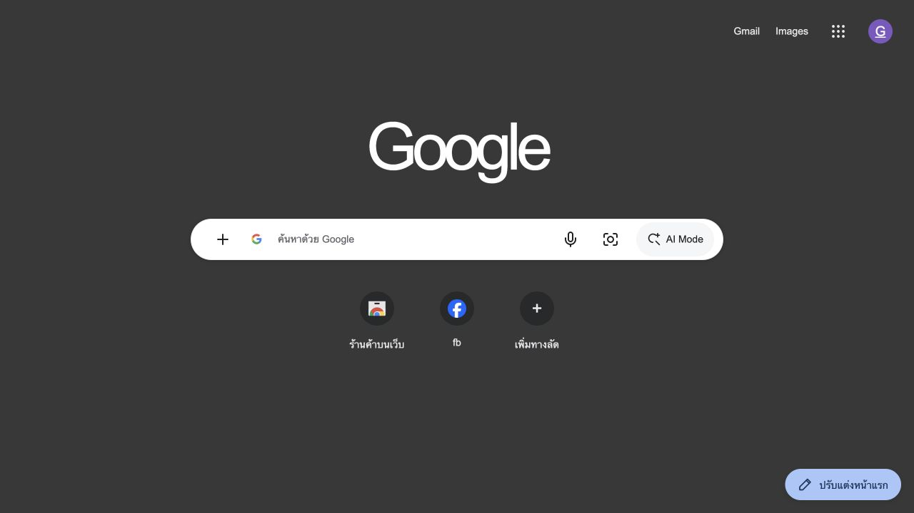
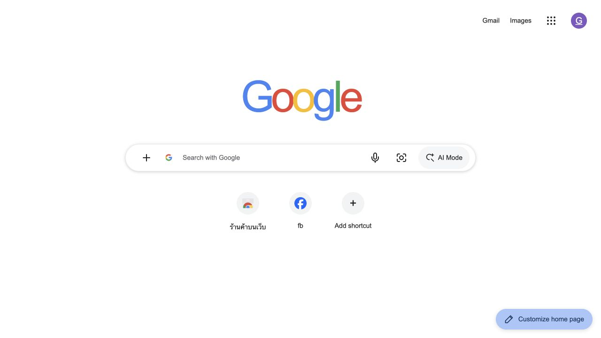
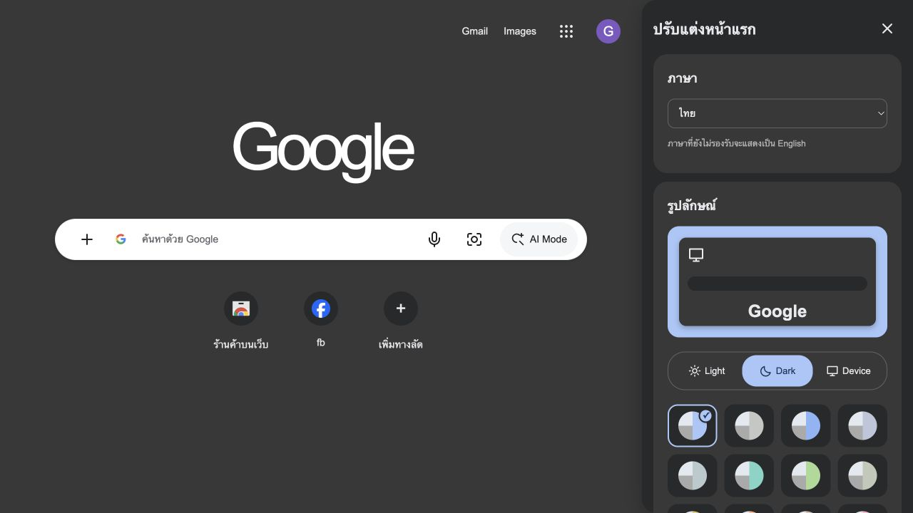
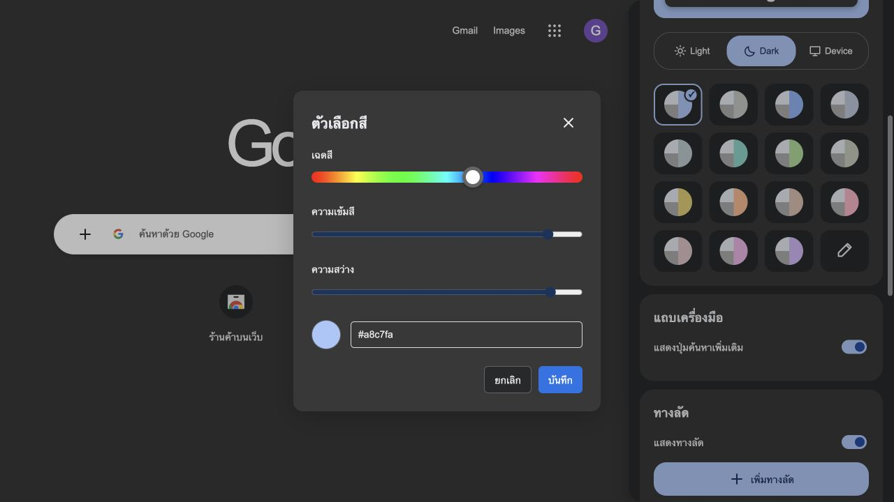
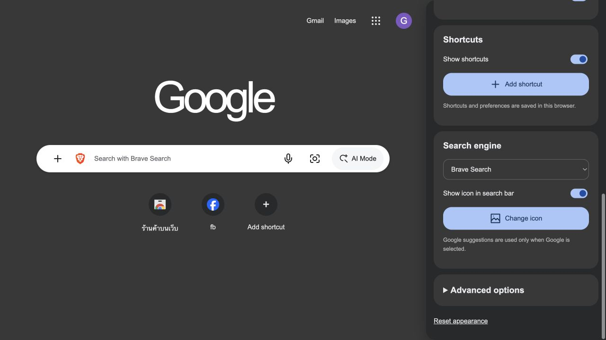
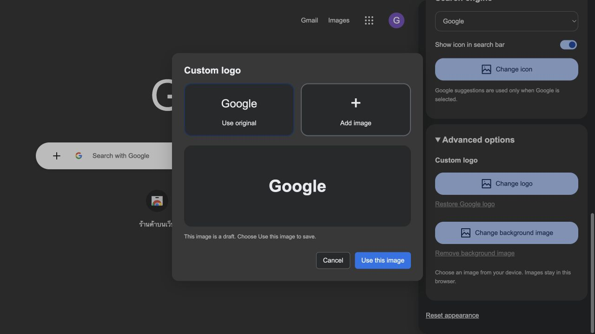
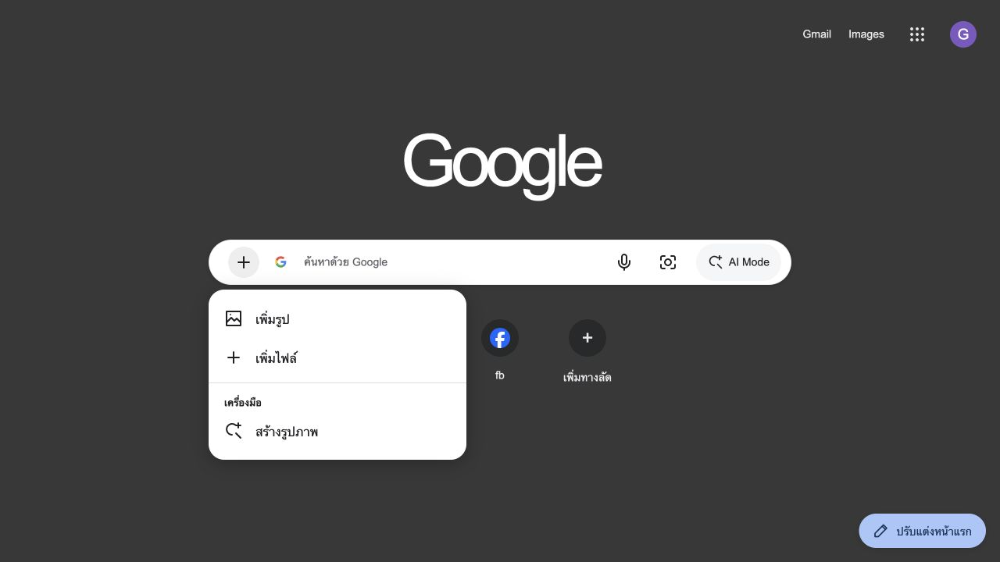

# Google-Chrome-Homepage

**หน้าแรกสำหรับ Brave และ Firefox พร้อมธีม ภาษา โลโก้ และเครื่องมือค้นหาที่เลือกเองได้**
**A customizable home page for Brave and Firefox with themes, languages, personal logos, and your choice of search engine.**

[ดาวน์โหลด / Download ZIP](https://github.com/Artyuiui/Google-Chrome-Homepage/archive/refs/heads/main.zip) · [ภาษาไทย](#ภาษาไทย) · [English](#english) · [ภาพฟีเจอร์ / Gallery](#feature-gallery)

ไม่ต้องติดตั้งส่วนขยายหรือรันเซิร์ฟเวอร์ เปิดจากไฟล์ในเครื่องได้โดยตรง
No extension or server required. Open the page directly from your computer.

## Preview · ตัวอย่างหน้าแรก

### ภาษาไทย · Dark theme



### English · Light theme



## Features · ฟีเจอร์

| ฟีเจอร์ | ภาษาไทย | English |
| --- | --- | --- |
| Search engines | เลือก Google, Bing, DuckDuckGo, Brave Search หรือ Yahoo | Choose Google, Bing, DuckDuckGo, Brave Search, or Yahoo. |
| Search icon | ใช้ไอคอนเครื่องมือค้นหา เปลี่ยนเป็นภาพเอง หรือซ่อนได้ | Use the provider icon, upload your own, or hide it. |
| Languages | อัตโนมัติตามภาษาเบราว์เซอร์ หรือเลือกไทย อังกฤษ ญี่ปุ่น จีน | Detect the browser language or choose Thai, English, Japanese, or Chinese. |
| Themes | Light / Dark / Device พร้อมชุดสีสำเร็จรูป | Light, Dark, and Device modes with preset color palettes. |
| Color picker | แถบรุ้ง ปรับความเข้ม ความสว่าง และรหัส HEX | Hue, saturation, lightness, and HEX controls. |
| Logo & background | เพิ่มรูป พรีวิวก่อนบันทึก หรือกลับไปใช้แบบดั้งเดิม | Preview a custom logo or background before saving, or restore the original. |
| Shortcuts | เพิ่ม แก้ไข ลบ และซ่อน/แสดงทางลัด | Add, edit, delete, show, or hide website shortcuts. |
| Google apps | เมนูแอปพร้อมไอคอนและแก้ไขรายการโปรด | App launcher with icons and editable favorites. |
| Suggestions | คำค้นแนะนำเมื่อเลือก Google ใช้ ↑ ↓ และ Enter ได้ | Google suggestions with arrow-key selection and Enter to search. |
| Plus menu | พรีวิวรูป/ไฟล์ในเครื่อง และลิงก์ไปบริการสร้างภาพ | Local image/file previews and a link to image creation. |
| Search tools | ค้นหาด้วยเสียงเมื่อเบราว์เซอร์รองรับ พร้อม Lens และ AI Mode | Voice search where supported, plus Google Lens and AI Mode links. |
| Saved preferences | จำภาษา ธีม รูป และค่าที่เลือกในเบราว์เซอร์ | Save language, appearance, images, and preferences in the browser. |

<a id="feature-gallery"></a>
## Feature gallery · ภาพฟีเจอร์

### 1. Appearance & language · รูปลักษณ์และภาษา

ปรับภาษาและธีมจากแผงด้านข้าง ใช้สีสำเร็จรูปหรือกำหนดเอง
Choose a language and theme in the side panel, then select a preset or custom color.



### 2. Color picker · ตัวเลือกสี

ปรับเฉดสี ความเข้ม ความสว่าง หรือใส่ HEX แล้วกดบันทึก ยกเลิกได้โดยไม่เปลี่ยนสีเดิม
Adjust hue, saturation, lightness, or HEX, then save. Cancel keeps your previous color.



### 3. Search engine & icon · เครื่องมือค้นหาและไอคอน

เลือกผู้ให้บริการค้นหาและเปลี่ยนไอคอนในช่องค้นหาได้ การตั้งค่านี้ใช้เฉพาะหน้าเว็บนี้
Choose the search provider and search-bar icon. This setting applies to this page only.



### 4. Image preview · พรีวิวโลโก้และพื้นหลัง

เปิด **ตัวเลือกขั้นสูง → เปลี่ยนโลโก้ / เปลี่ยนภาพพื้นหลัง** เลือก **เพิ่มรูป** หรือ **ใช้แบบดั้งเดิม** จากนั้นกด **ใช้รูปนี้**
Open **Advanced options → Change logo / Change background image**, choose **Add image** or **Use original**, then confirm with **Use this image**.



### 5. Plus menu · เมนูปุ่มบวก

เลือกภาพหรือไฟล์เพื่อพรีวิวในเครื่อง หากต้องการค้นหาหรือวิเคราะห์ ให้เปิด Lens/Gemini แล้วแนบไฟล์ในบริการนั้น
Select images or files for a local preview. To search or analyze them, open Lens/Gemini and attach the files there.



## ภาษาไทย

### ติดตั้งเองทีละขั้น

1. เปิด [หน้า GitHub](https://github.com/Artyuiui/Google-Chrome-Homepage) แล้วกด **Code → Download ZIP**
2. แตก ZIP และย้ายโฟลเดอร์ไปเก็บในตำแหน่งถาวร เช่น `Documents/brave-home`
3. เก็บไฟล์ **ทั้ง 5 ตัว** ไว้ในโฟลเดอร์เดียวกัน: `index.html`, `enhancements.css`, `enhancements.js`, `localization.js`, `experience.js`
4. เปิด Brave แล้วกด **Command + O** บน Mac หรือ **Ctrl + O** บน Windows/Linux เลือก `index.html`
5. กด **Command + L / Ctrl + L** แล้วคัดลอกที่อยู่ `file:///.../index.html` จากแถบที่อยู่
6. ไปที่ `brave://settings/appearance` เปิด **Show home button** เลือก **Enter custom web address** แล้ววางที่อยู่ไฟล์ กด Tab เพื่อบันทึก
7. ไปที่ `brave://settings/getStarted` ในหัวข้อ **New Tab Page** ตั้ง **New tab page shows → Homepage**
8. ถ้าต้องการให้แสดงตอนเปิด Brave ด้วย ในหัวข้อ **On startup** เลือก **Open the New Tab page**
9. เปิดแท็บใหม่ด้วย **Command + T / Ctrl + T** และลองกดปุ่มรูปบ้าน เพื่อทดสอบ

ใช้ที่อยู่จากเครื่องของคุณเอง ไม่ต้องใช้ `localhost` และอย่าย้ายโฟลเดอร์หลังตั้งค่า หากย้ายต้องอัปเดตที่อยู่ Homepage ใหม่ ชื่อเมนูอาจต่างตามภาษา/เวอร์ชัน ขั้นตอนนี้ตรวจจาก Brave บน macOS 1.95.101

### ตั้งหน้าแรกใน Firefox

1. เปิด `index.html` ใน Firefox และคัดลอกที่อยู่ `file:///.../index.html`
2. เปิด `about:preferences#home` → **Home and startup**
3. ใน **Homepage → New windows** เลือก **Custom URLs…**
4. กด **Choose a specific site** วางที่อยู่ใน **Enter address** แล้วกด **Add address**
5. หากต้องการเปิดหน้าแรกตอนเริ่ม Firefox ให้ปิด **Open previous windows and tabs**
6. กด **Command + N / Ctrl + N** เพื่อทดสอบหน้าต่างใหม่

ตรวจจาก Firefox 155.0.1 บน macOS: ตั้งหน้า Home/หน้าต่างใหม่ได้ แต่เมนู **New tabs** มีเพียง Firefox Home และ Blank Page จึงยังไม่เปลี่ยนแท็บใหม่เป็นไฟล์นี้ ชื่อเมนูในเวอร์ชันอื่นอาจต่างกัน

### วิธีใช้

- **ภาษา:** ปรับแต่งหน้าแรก → ภาษา รองรับไทย อังกฤษ ญี่ปุ่น จีน ค่าอัตโนมัติอ่านภาษาหลักที่เบราว์เซอร์แจ้ง ซึ่งอาจต่างจากภาษา OS ภาษาที่ไม่รองรับใช้ English
- **สี:** กดไอคอนดินสอท้ายชุดสีเพื่อเปิด Color picker
- **โลโก้/พื้นหลัง:** ตัวเลือกขั้นสูง → เลือกรูป → ดูพรีวิว → ใช้รูปนี้ รูปต้องไม่เกิน **3 MB ต่อไฟล์** และเป็นรูปแบบที่เบราว์เซอร์อ่านได้
- **เครื่องมือค้นหา:** เลือกผู้ให้บริการในแผงปรับแต่ง มีผลกับ Enter และผลจากไมโครโฟน ไอคอนที่อัปโหลดเองใช้ร่วมกับทุกผู้ให้บริการจนกว่าจะคืนค่าเดิม
- **ทางลัด:** กดเพิ่มทางลัด หรือปุ่ม `⋮` บนทางลัดเพื่อแก้ไข/ลบ
- **แอปโปรด:** เปิดเมนูเก้าจุด แล้วกดดินสอเพื่อเลือกรายการโปรด

### อัปเดตเวอร์ชัน

ดาวน์โหลด ZIP ใหม่ แล้วนำไฟล์หลักทั้ง 5 ตัวไปแทนไฟล์เดิมในตำแหน่งเดิม จากนั้นกด **Command + Shift + R** บน Mac หรือ **Ctrl + Shift + R** บน Windows/Linux

### สิ่งที่ควรทราบ

- ค่าปรับแต่งและภาพบันทึกใน Local Storage ไม่อัปโหลดรูปโลโก้หรือพื้นหลังไปเซิร์ฟเวอร์ หากพื้นที่เต็มหรือรูปอ่านไม่ได้ จะคงรูปเดิมและแจ้งเตือน
- การล้างข้อมูล เปลี่ยนโปรไฟล์ หรือย้ายไฟล์อาจทำให้ค่าเดิมไม่ปรากฏ การเก็บข้อมูลสำหรับ `file://` ขึ้นอยู่กับเบราว์เซอร์
- การค้นหา คำค้นแนะนำ ไอคอนบางส่วน และบริการภายนอกต้องใช้อินเทอร์เน็ต คำแนะนำจาก Google ทำงานเมื่อเลือก Google เท่านั้น
- รูป/ไฟล์ที่เลือกในเมนูบวกเป็นพรีวิวในเครื่อง **ไม่ได้แนบไปกับคำค้น** ปุ่มสร้างรูปภาพเปิด Gemini ในแท็บใหม่ ไม่ได้สร้างภาพภายในหน้าเว็บนี้
- ค้นหาด้วยเสียงขึ้นอยู่กับการรองรับของเบราว์เซอร์และสิทธิ์ไมโครโฟน Lens และ AI Mode ยังคงเป็นบริการของ Google
- การปรับธีมและ Search engine ไม่เปลี่ยนธีมของ Brave หรือผู้ให้บริการค้นหาในแถบที่อยู่
- ไม่อ่านประวัติเบราว์เซอร์หรือแท็บอื่น จึงไม่มี Most visited sites / Continue with these tabs จาก Brave ปุ่มบัญชีเป็นลิงก์ ไม่ได้ซิงค์ข้อมูลบัญชี Google

### แก้ปัญหาเบื้องต้น

| อาการ | วิธีแก้ |
| --- | --- |
| หน้าตาไม่ครบหรือปุ่มไม่ทำงาน | ตรวจว่าไฟล์หลักทั้ง 5 ตัวอยู่ด้วยกัน แล้วรีโหลด |
| แท็บใหม่ยังเป็นหน้า Brave | ตั้ง New tab page shows เป็น Homepage |
| หาไฟล์ไม่พบ | เปิดไฟล์จากตำแหน่งใหม่ แล้วนำที่อยู่ไปตั้ง Homepage ใหม่ |
| รูปบันทึกไม่ได้ | ลดขนาดรูป ตรวจพื้นที่จัดเก็บและสิทธิ์ของเบราว์เซอร์ |
| ไมโครโฟนใช้ไม่ได้ | ตรวจการรองรับและสิทธิ์ หรือพิมพ์ค้นหาแทน |

## English

### Install step by step

1. Open the [GitHub repository](https://github.com/Artyuiui/Google-Chrome-Homepage) and select **Code → Download ZIP**.
2. Extract the ZIP and move the folder to a permanent location, such as `Documents/brave-home`.
3. Keep **all five application files together**: `index.html`, `enhancements.css`, `enhancements.js`, `localization.js`, and `experience.js`.
4. Open Brave. Press **Command + O** on Mac or **Ctrl + O** on Windows/Linux, then select `index.html`.
5. Press **Command + L / Ctrl + L** and copy the `file:///.../index.html` address.
6. Open `brave://settings/appearance`, enable **Show home button**, select **Enter custom web address**, and paste the file address. Press Tab to save.
7. Open `brave://settings/getStarted`. Under **New Tab Page**, set **New tab page shows → Homepage**.
8. To show this page when Brave starts, select **On startup → Open the New Tab page**.
9. Open a new tab with **Command + T / Ctrl + T** and test the Home button.

Use the file address from your own computer. No `localhost` server is needed. If you move the folder later, update the homepage address. Menu labels may vary by language/version; these steps were checked in Brave 1.95.101 on macOS.

### Set the homepage in Firefox

1. Open `index.html` in Firefox and copy its `file:///.../index.html` address.
2. Open `about:preferences#home` → **Home and startup**.
3. Under **Homepage → New windows**, choose **Custom URLs…**.
4. Click **Choose a specific site**, paste the address into **Enter address**, and click **Add address**.
5. To show the homepage at startup, turn off **Open previous windows and tabs**.
6. Press **Command + N / Ctrl + N** to test a new window.

Checked in Firefox 155.0.1 on macOS: Home/new windows support custom URLs, but **New tabs** offers only Firefox Home or Blank Page. This setup therefore does not replace the new-tab page. Labels may differ in other versions.

### Usage

- **Language:** Customize home page → Language. Supports Thai, English, Japanese, and Chinese. Automatic mode follows the primary language reported by the browser, which may differ from the OS language. Unsupported languages fall back to English.
- **Color:** Click the pencil tile at the end of the palette to open the color picker.
- **Logo/background:** Advanced options → choose an image → review the preview → Use this image. Each image must be **3 MB or smaller** and decodable by the browser.
- **Search engine:** Choose a provider in the customization panel. It handles Enter searches and recognized voice queries. A custom icon is shared across providers until you restore the original.
- **Shortcuts:** Use Add shortcut, or the `⋮` button on a shortcut to edit/delete it.
- **Favorite apps:** Open the nine-dot launcher and click the pencil to edit favorites.

### Updating

Download the latest ZIP, replace all five application files in the same folder, then press **Command + Shift + R** on Mac or **Ctrl + Shift + R** on Windows/Linux.

### Behavior and limitations

- Preferences and images are saved in Local Storage. Custom logos/backgrounds are not uploaded to a server. Storage failures or unreadable images keep the previous image and show a message.
- Clearing browser data, changing profiles, or moving files may make saved preferences unavailable. Storage behavior for `file://` depends on the browser.
- Search, suggestions, some icons, and external services require internet access. Google suggestions are requested only when Google is selected.
- Files chosen through the plus menu are local previews and **are not attached to search requests**. Create images opens Gemini in a new tab; it does not generate images inside this page.
- Voice search depends on browser support and microphone permission. Lens and AI Mode remain Google services.
- Theme and search-provider changes affect this page only, not Brave's toolbar theme or address-bar search engine.
- This page does not read browser history or other tabs, so it cannot populate Brave's Most visited sites or Continue with these tabs. The account button is a link, not Google account synchronization.

### Troubleshooting

| Problem | Solution |
| --- | --- |
| Missing styles or inactive controls | Keep all five application files together and reload. |
| New tabs still show Brave's default page | Set New tab page shows to Homepage. |
| File not found | Open the file at its new location and update the homepage address. |
| Image cannot be saved | Use a smaller image and check browser storage availability. |
| Voice search is unavailable | Check support/permissions, or type your query. |

## Files · โครงสร้างไฟล์

```text
brave-home/
├── index.html          # Page and shortcut/search logic
├── enhancements.css    # Themes and interface styles
├── enhancements.js     # App launcher and preferences
├── localization.js     # Languages and personalization
├── experience.js       # Search providers, previews, color picker, plus menu
├── README.md
├── LICENSE
└── assets/             # Screenshots used in this README
```

## License & attribution · สิทธิ์การใช้งาน

[MIT License](LICENSE). โปรเจกต์อิสระ ไม่ใช่ผลิตภัณฑ์ทางการของ Google หรือ Brave เครื่องหมายการค้าเป็นของเจ้าของแต่ละราย
Independent project; not an official Google or Brave product. Product names and trademarks belong to their respective owners.
