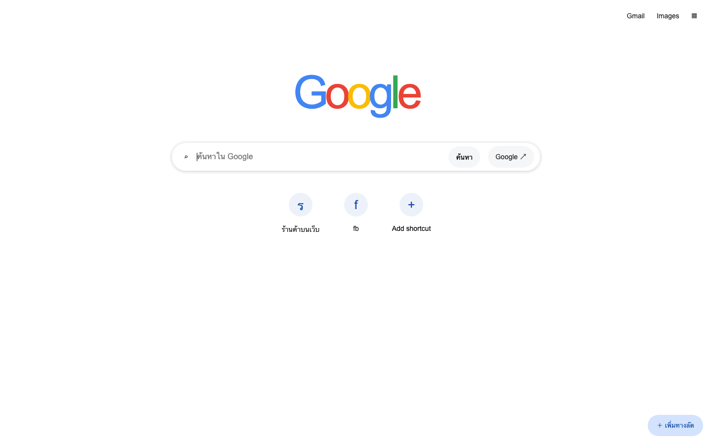

# Brave Google-style Home Page

หน้าแรกแบบเรียบง่ายสำหรับ Brave Browser ที่ออกแบบให้คล้ายหน้า Google New Tab พร้อมช่องค้นหา คำค้นแนะนำ และทางลัดเว็บไซต์ที่ปรับแต่งได้



## ฟีเจอร์

- ค้นหาด้วย Google จากหน้าแรก
- แสดงคำค้นแนะนำจาก Google ขณะพิมพ์
- ใช้ปุ่มลูกศร `↑` และ `↓` เพื่อเลือกคำแนะนำ แล้วกด `Enter` เพื่อค้นหา
- เพิ่ม แก้ไข และลบทางลัดเว็บไซต์ได้
- บันทึกทางลัดไว้ในเบราว์เซอร์ด้วย Local Storage
- รองรับหน้าจอคอมพิวเตอร์และมือถือ
- เมนูแอป Google พร้อมไอคอนและเลือกรายการโปรด
- ปรับธีม Light / Dark / Device เลือกสี และอัปโหลดภาพพื้นหลัง
- ซ่อน/แสดงทางลัดและปุ่มค้นหาเพิ่มเติม
- ปุ่มค้นหาด้วยเสียง (ขึ้นอยู่กับเบราว์เซอร์), Google Lens และ AI Mode
- ไม่ต้องติดตั้งแพ็กเกจ เก็บ index.html, enhancements.css และ enhancements.js ไว้ในโฟลเดอร์เดียวกัน

## ติดตั้งเองทีละขั้น (Brave บนคอมพิวเตอร์)

ไม่ต้องติดตั้งส่วนขยาย ไม่ต้องใช้ Terminal และไม่ต้องเปิดเซิร์ฟเวอร์

### 1. ดาวน์โหลดและเก็บไฟล์

1. เปิด [GitHub repository](https://github.com/Artyuiui/brave-google-homepage)
2. กดปุ่ม **Code** แล้วเลือก **Download ZIP**
3. แตกไฟล์ ZIP แล้วนำโฟลเดอร์ไปไว้ในตำแหน่งถาวร เช่น **Documents/brave-home**
4. ตรวจว่า `index.html`, `enhancements.css`, `enhancements.js` และ `localization.js` อยู่ในโฟลเดอร์เดียวกัน ห้ามดาวน์โหลดเฉพาะ `index.html`

### 2. เปิดหน้าเว็บใน Brave และคัดลอกที่อยู่

1. เปิด Brave
2. กด **Command + O** บน Mac หรือ **Ctrl + O** บน Windows/Linux
3. เลือกไฟล์ `index.html` จากโฟลเดอร์ที่แตกไว้ แล้วกด **Open**
4. ตรวจว่าหน้าแรกแสดงปุ่ม **ปรับแต่งหน้าแรก** และเมนูแอป Google
5. กด **Command + L** / **Ctrl + L** เพื่อเลือกที่อยู่ แล้วกด **Command + C** / **Ctrl + C** เพื่อคัดลอก

ที่อยู่จะเริ่มด้วย `file:///` ตัวอย่าง (ให้ใช้ที่อยู่ที่คัดลอกจากเครื่องของคุณ):

```text
macOS:   file:///Users/YOUR_NAME/Documents/brave-home/index.html
Windows: file:///C:/Users/YOUR_NAME/Documents/brave-home/index.html
Linux:   file:///home/YOUR_NAME/Documents/brave-home/index.html
```

### 3. ตั้งปุ่ม Home

1. เปิดแท็บใหม่ พิมพ์ `brave://settings/appearance` แล้วกด Enter
2. เปิด **Show home button**
3. ใต้ตัวเลือกนี้ เลือกช่อง **Enter custom web address** แทน **New Tab page**
4. วางที่อยู่ `file:///.../index.html` ที่คัดลอกไว้
5. กด **Tab** หรือคลิกนอกช่องเพื่อให้บันทึกค่า

### 4. ตั้งให้เปิดทุกครั้งที่สร้างแท็บใหม่

1. พิมพ์ `brave://settings/getStarted` ในแถบที่อยู่ แล้วกด Enter
2. หาหัวข้อ **New Tab Page**
3. ที่ **New tab page shows** เลือก **Homepage**
4. กด **Command + T** / **Ctrl + T** เพื่อตรวจว่าหน้าเว็บนี้เปิดขึ้นมา

### 5. ตั้งหน้าเมื่อเริ่มเปิด Brave

1. อยู่ที่ `brave://settings/getStarted`
2. ในหัวข้อ **On startup** เลือก **Open the New Tab page**
3. เมื่อเปิด Brave ครั้งใหม่ จะใช้หน้าแท็บใหม่ที่ตั้งเป็น Homepage ไว้ (หาก Brave กู้คืนเซสชันหลังปิดผิดปกติ อาจแสดงแท็บเดิม)

### 6. ตรวจและเริ่มปรับแต่ง

- กดปุ่มรูปบ้าน **Home**: ต้องเปิดหน้าเว็บนี้
- เปิดแท็บใหม่: ต้องเปิดหน้าเว็บนี้
- กด **ปรับแต่งหน้าแรก** เพื่อเลือกธีม สี พื้นหลัง และการแสดงทางลัด
- กดเมนูเก้าจุดเพื่อเปิดแอป Google และกดดินสอเพื่อแก้ไขรายการโปรด

ชื่อเมนูอาจต่างกันตามภาษาและเวอร์ชันของ Brave ขั้นตอนนี้ตรวจจาก Brave บน macOS เวอร์ชัน 1.95.101

### อัปเดตเวอร์ชันภายหลัง

1. ดาวน์โหลด ZIP เวอร์ชันใหม่จาก GitHub และแตกไฟล์
2. นำ `index.html`, `enhancements.css`, `enhancements.js` และ `localization.js` ใหม่ไปแทนไฟล์เดิมในโฟลเดอร์เดิม
3. รีโหลดหน้าเว็บด้วย **Command + R** / **Ctrl + R**

เก็บตำแหน่งและชื่อไฟล์เดิมไว้เพื่อไม่ต้องตั้ง Homepage ใหม่ ค่าปรับแต่งเก็บใน Local Storage ของเบราว์เซอร์ การย้ายไฟล์ เปลี่ยนโปรไฟล์ หรือล้างข้อมูลอาจทำให้ค่าเดิมไม่ปรากฏ และการเก็บข้อมูลสำหรับ `file://` ขึ้นอยู่กับเบราว์เซอร์

### แก้ปัญหาเบื้องต้น

- **หน้าเว็บไม่มีรูปแบบหรือปุ่มไม่ทำงาน:** ตรวจว่าไฟล์ CSS และ JS อยู่ข้าง `index.html` แล้วรีโหลด
- **เปิดแท็บใหม่แล้วยังเป็นหน้า Brave:** ตรวจว่า **New tab page shows** เป็น **Homepage**
- **หาไฟล์ไม่พบ:** ถ้าย้ายโฟลเดอร์ ให้เปิด `index.html` จากตำแหน่งใหม่แล้วคัดลอกที่อยู่ไปตั้งใหม่
- **ที่อยู่เป็น localhost:** เปิดไฟล์ด้วยขั้นตอนที่ 2 แล้วใช้ที่อยู่ `file:///` เพื่อไม่ต้องรันเซิร์ฟเวอร์
- **ไมโครโฟนใช้งานไม่ได้:** การค้นหาด้วยเสียงต้องอาศัยการรองรับและสิทธิ์ไมโครโฟนของเบราว์เซอร์ ยังพิมพ์ค้นหาได้ตามปกติ

## การจัดการทางลัด

- กด **Add shortcut** หรือ **เพิ่มทางลัด** เพื่อเพิ่มเว็บไซต์
- ชี้เมาส์บนทางลัดแล้วกดปุ่ม `⋮` เพื่อแก้ไขหรือลบ
- ทางลัดจะถูกเก็บไว้เฉพาะในโปรไฟล์ Brave และอุปกรณ์ที่ใช้งาน

## หมายเหตุ

คำค้นแนะนำต้องเชื่อมต่ออินเทอร์เน็ต เพราะดึงข้อมูลจากบริการแนะนำคำค้นของ Google หากบริการดังกล่าวไม่ตอบสนอง ช่องค้นหายังสามารถค้นหาได้ตามปกติ

## โครงสร้างไฟล์

```text
brave-home/
├── index.html
├── enhancements.css
├── enhancements.js
├── localization.js
├── README.md
└── assets/
    └── preview.png
```

## License

เผยแพร่ภายใต้ [MIT License](LICENSE)

## การปรับแต่งหน้าแรก

กดปุ่ม **ปรับแต่งหน้าแรก** มุมขวาล่างเพื่อเลือกธีม สี หรือภาพพื้นหลัง (ไม่เกิน 3 MB) การตั้งค่ามีผลเฉพาะหน้าเว็บนี้ ไม่เปลี่ยนธีมของตัวเบราว์เซอร์ กดไอคอนเก้าจุดเพื่อเปิดแอป Google และใช้ไอคอนดินสอเพื่อเลือกรายการโปรด

ปุ่มบวกในช่องค้นหาและ Lens เปิดบริการ Google Lens ส่วน AI Mode เปิด Google Search ในโหมด AI ตามความพร้อมของบริการ บัญชีด้านบนเป็นลิงก์ไปยังบัญชี Google ไม่ได้ดึงรูปหรือข้อมูลโปรไฟล์มาแสดง ไอคอนเว็บไซต์บางส่วนโหลดจาก Google และต้องใช้อินเทอร์เน็ต

## ภาษาและตัวเลือกขั้นสูง

- ค่าเริ่มต้น **อัตโนมัติ (ตามเครื่อง)** ใช้ภาษาหลักที่เบราว์เซอร์แจ้ง (`navigator.languages`) ซึ่งอาจต่างจากภาษา OS ถ้าตั้งค่าเบราว์เซอร์ไว้ต่างกัน
- รองรับ **ไทย, English, 日本語, 中文** ภาษาที่ยังไม่รองรับใช้ English
- เปลี่ยนภาษาได้ใน **ปรับแต่งหน้าแรก → ภาษา** โดยมีผลทันทีและบันทึกไว้ ชื่อแท็บเป็น **New Tab** เมื่อใช้ภาษาอังกฤษ
- ภาษาที่เลือกใช้กับข้อความ UI คำค้นแนะนำที่ร้องขอจาก Google และภาษารับเสียง โดยไม่แปลชื่อทางลัดที่ผู้ใช้ตั้งหรือเนื้อหาผลค้นหา
- เปิด **ปรับแต่งหน้าแรก → ตัวเลือกขั้นสูง → เปลี่ยนโลโก้** เพื่อแทนโลโก้ Google ด้วยรูปจากเครื่อง ใช้ **คืนค่าโลโก้ Google** เพื่อกลับไปใช้แบบเดิม
- ในหัวข้อเดียวกัน กด **เปลี่ยนภาพพื้นหลัง** หรือ **นำภาพพื้นหลังออก**
- รูปแต่ละไฟล์ต้องไม่เกิน **3 MB** และเป็นรูปแบบที่เบราว์เซอร์อ่านได้ พื้นที่รวมขึ้นอยู่กับ Local Storage ของเบราว์เซอร์ หากพื้นที่เต็มหรือรูปเสียจะแจ้งเตือนและเก็บรูปเดิมไว้
- รูปที่เลือกเก็บในเบราว์เซอร์นี้ ไม่อัปโหลดไปเซิร์ฟเวอร์ รูปกับค่าที่เลือกยังอยู่หลังรีโหลด การล้างข้อมูลเว็บไซต์อาจลบค่าที่บันทึกไว้
- เมื่ออัปเดตจากเวอร์ชันก่อน ต้องคัดลอก **localization.js** เพิ่มไว้ข้าง **index.html** ด้วย
